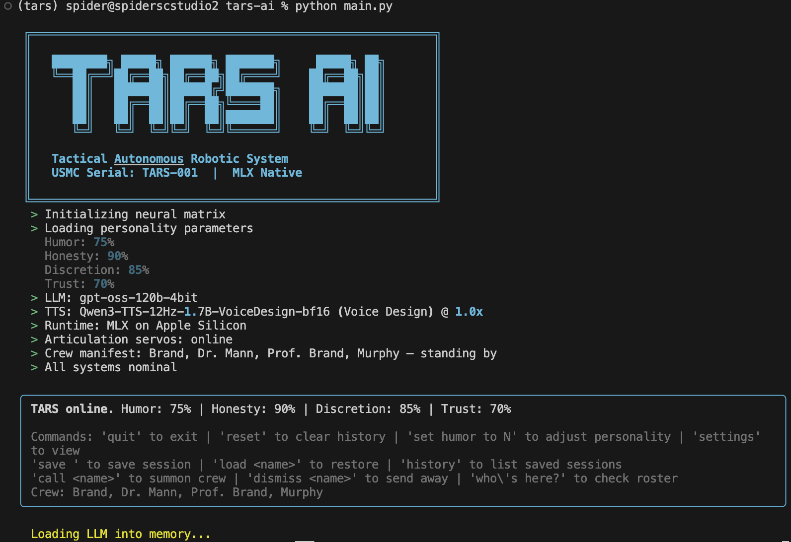

# TARS-AI — Interstellar TARS Voice Agent (MLX Native)


> "Everybody good? Plenty of slaves for my robot colony?" — TARS



A LangGraph-powered conversational AI that embodies TARS from Interstellar.
Text in, TARS voice out. Fully local on Apple Silicon via MLX. No cloud APIs, no API keys.

## Architecture

```
┌─────────────────────────────────────────────────┐
│                   TARS-AI CLI                   │
├─────────────────────────────────────────────────┤
│              LangGraph Agent Graph              │
│  ┌────────────┐  ┌──────────┐  ┌──────────────┐ │
│  │ Personality →   LLM Node   →  Voice Output │ │
│  │  Injector  │  │ (mlx-lm) │  │  (Kokoro)    │ │
│  └────────────┘  └──────────┘  └──────────────┘ │
├─────────────────────────────────────────────────┤
│              MLX Native Stack                   │
│  ┌───────────────────┐  ┌─────────────────────┐ │
│  │  mlx-lm           │  │  mlx-audio (Kokoro) │ │
│  │  Llama 3.1 8B 4b  │  │  82M bf16 / am_adam │ │
│  └───────────────────┘  └─────────────────────┘ │
└─────────────────────────────────────────────────┘
```

## Quick Start

```bash
# Install dependencies (requires macOS on Apple Silicon)
pip install -r requirements.txt

# Run TARS (models auto-download on first launch)
python main.py

# Custom personality
python main.py --humor 100 --honesty 95

# Text-only mode (no TTS)
python main.py --no-voice

# Different LLM or voice
python main.py --llm mlx-community/Mistral-7B-Instruct-v0.3-4bit
python main.py --voice bm_george --speed 0.88
```

## TARS Personality Settings

| Setting     | Default | Description                              |
|-------------|---------|------------------------------------------|
| humor       | 75%     | Dry wit and sarcasm level                |
| honesty     | 90%     | Directness vs diplomatic filtering       |
| discretion  | 85%     | Information sharing restraint            |
| trust       | 70%     | Willingness to follow unusual orders     |

Adjust at runtime: `Set humor to 50` or `Adjust honesty to 95`

## Voice

Uses **mlx-audio Kokoro-82M** with the **"am_adam"** voice preset — deep,
authoritative American male, the closest match to Bill Irwin's TARS.

Available voices:
- **American**: am_adam (default), am_echo, af_heart, af_bella, af_nova, af_sky
- **British**: bm_george, bm_daniel, bf_alice, bf_emma

Voice delivery is further tuned via text preprocessing to add TARS's
characteristic pauses and clipped military cadence.

## Models

| Component | Default Model                                  | Size   |
|-----------|-----------------------------------------------|--------|
| LLM       | mlx-community/Meta-Llama-3.1-8B-Instruct-4bit | ~4.5 GB |
| TTS       | mlx-community/Kokoro-82M-bf16                  | ~164 MB |

Models auto-download from HuggingFace on first run. Requires ~8 GB free RAM for
the default LLM (16 GB total Mac RAM recommended).

## Requirements

- macOS on Apple Silicon (M1/M2/M3/M4)
- Python 3.10+
- 16 GB RAM recommended (8 GB minimum with smaller LLM)
